# 🛒 ShopNow E-Commerce - Kubernetes Assignment
ShopNow is a  built around a full-stack MERN e-commerce application:
- **Customer App** (React frontend)  
- **Admin Dashboard** (React admin panel)  
- **Backend API** (Express + MongoDB)  

## 📁 Project Structure

```
shopNow/
├── backend/               # Node.js API server
├── frontend/              # React customer app
├── admin/                 # React admin dashboard
├── kubernetes
│   ├── k8s-manifests/     # Raw Kubernetes YAML files
│   ├── helm/              # Helm charts for package management
│   │   └── charts/        # Individual charts
│   ├── argocd/            # GitOps deployment configs
│   └── pre-req/           # Cluster prerequisites
├── jenkins/               # Pipeline definitions (CI & CD)       
├── docs/                  # learning resources and guides
└── scripts/               # Automation and utility scripts
```

---
## Getting Started

## 🛠 Prerequisites & Setup

#### 1. Create EKS cluster by clickops on the AWS console and added worker nodes by adding the node group with minimum addons.

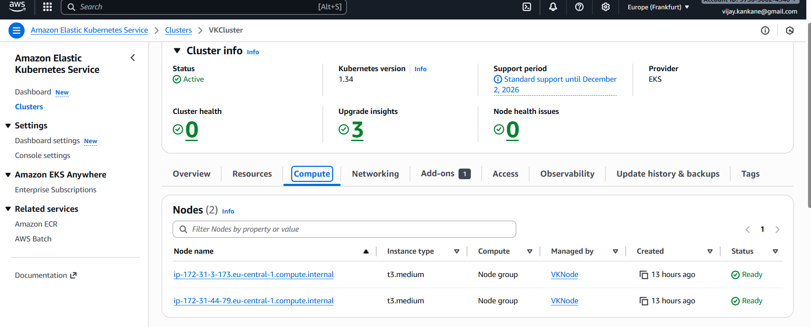


#### 2. AWS ECR Registry Setup 

# Setup AWS credentials first
aws configure

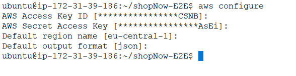


# If above credentials are already set, run below command to verify
aws sts get-caller-identity


# Create ECR repositories from CLI

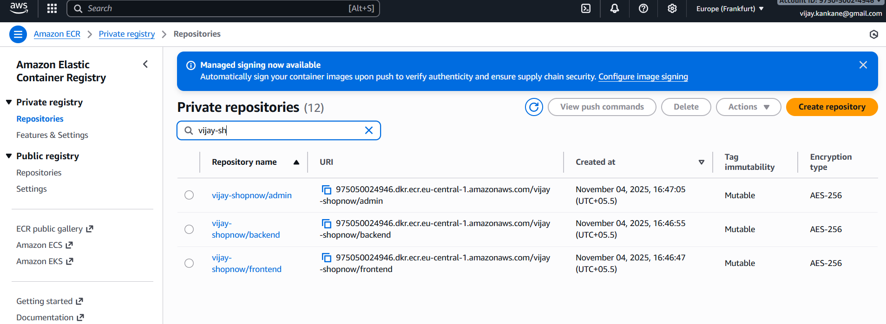


# Get login token (run this command everytime as the docker credentials are persisted only on the terminal)
aws ecr get-login-password --region <region> | docker login --username AWS --password-stdin <account-id>.dkr.ecr.<region>.amazonaws.com
```


#### 3. Kubernetes Cluster Access (Make sure to have a running Kubernetes cluster, here is an example to connect with EKS)
```bash
# For EKS cluster
aws eks update-kubeconfig --region <region> --name <your-cluster-name>

# Verify access
kubectl cluster-info
kubectl get nodes
```


#### 4. Docker Registry Secret 

```bash
# Create registry secret for private ECR image pulls
kubectl create ns vijay

kubectl create secret docker-registry ecr-secret --docker-server=<account-id>.dkr.ecr.us-east-1.amazonaws.com --docker-username=AWS --docker-password=$(aws ecr get-login-password --region eu-central-1) --namespace=vijay 

```

#### 6. Install Pre-requisites in the Kubernetes Environment (Has to be done once per Kubernetes Cluster)

# Install metrics server (required for resource monitoring and HPA)

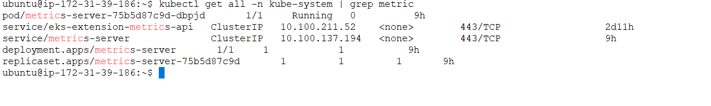

# Install ingress-nginx controller (for external access)
# For EKS, other cloud provider will have different file

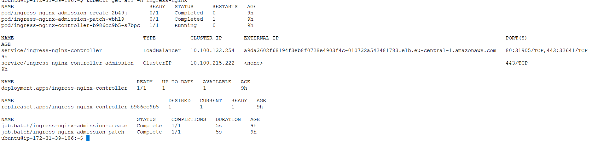


# To enable Persistent Storage

# First install the EBS CSI driver as an EKS Addon

# Verify storage class installation
kubectl get storageclass
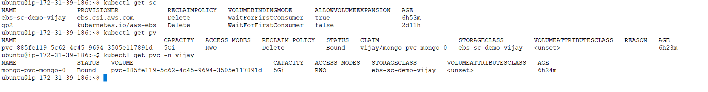


## ⚡ Build and Deploy the micro-services

### 5. Build the docker images and push it to the ECR registry created above

```bash
scripts/build-and-push.sh <account-id>.dkr.ecr.<region>.amazonaws.com/vijay-shopnow v1.0 vijay 


```

### 2. Choose Your Deployment Method

**Option A: Raw Kubernetes Manifests**
sh apply.sh 
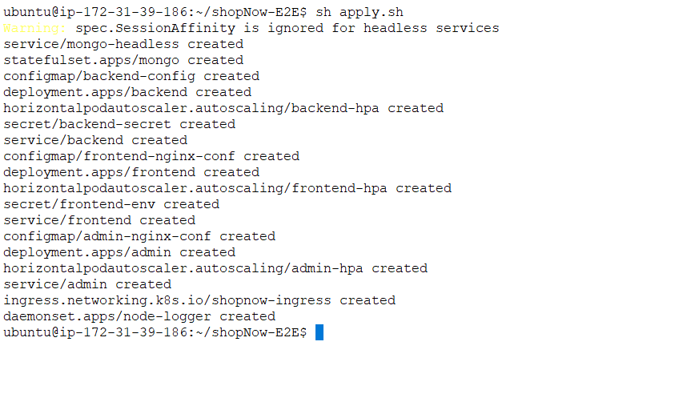


sh delete.sh {to delete the resources}

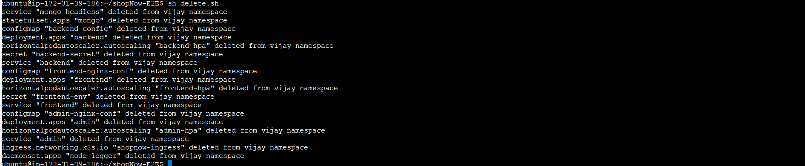

**Option B: Helm Charts**

sh applyHelm.sh

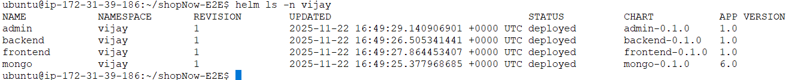

sh uninstallHelm.sh
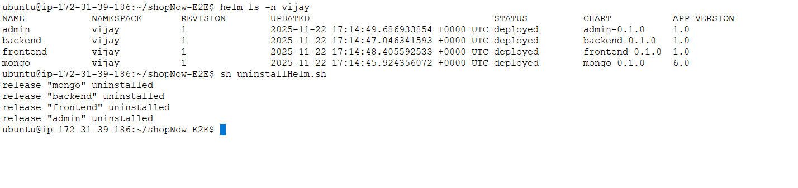


**Option C: ArgoCD GitOps**
```bash
# Install ArgoCD first
kubectl create namespace argocd
kubectl apply -n argocd -f https://raw.githubusercontent.com/argoproj/argo-cd/stable/manifests/install.yaml

```

# Deploy applications
kubectl apply -f kubernetes/argocd/umbrella-application.yaml

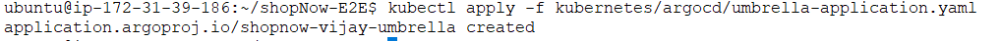

# Check all ArgoCD application status:
kubectl get applications -n argocd

```


### 3. Check the resources deployed

```

# Check ingress
kubectl get ing -n vijay

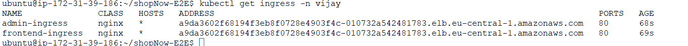


## 🌐 Access the Apps

* **Customer App** → 

http://a9da3602f68194f3eb8f0728e4903f4c-010732a542481783.elb.eu-central-1.amazonaws.com/vijay

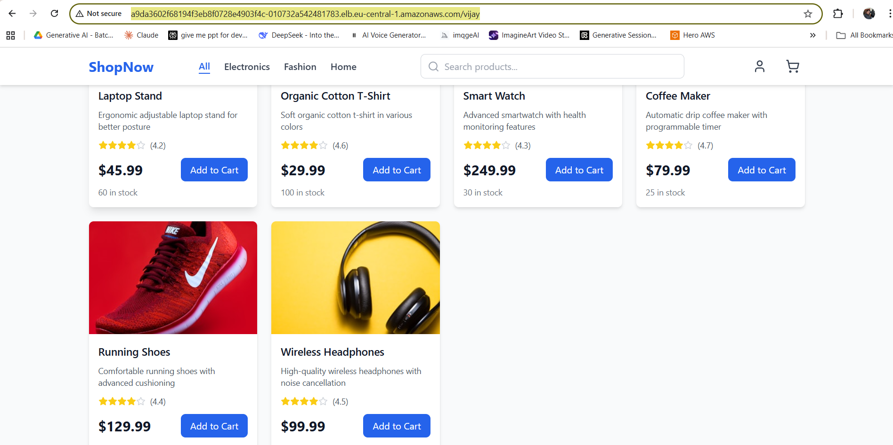


* **Admin Dashboard** → 

http://a9da3602f68194f3eb8f0728e4903f4c-010732a542481783.elb.eu-central-1.amazonaws.com/vijay-admin


---

## Additional Notes 
1. please ensure AWS CSI addon is enable else mongo pod will not coming up , and pvc is in pending state.
2. HPA will work with metric server only.
3. ingress controller must be install to make things working though single load balancer.


